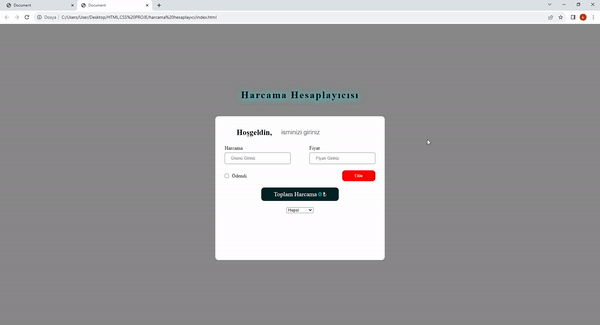

<h1>Spending-Calculator Project</h1>

Designing an Expense Calculator is a handy tool that will provide great convenience in various situations, whether you're shopping or tracking your financial expenditures. In this project, powerful web technologies like HTML, CSS3, and JavaScript have been used. With HTML and CSS3, the user interface is designed to be user-friendly and easily accessible to everyone. Using JavaScript, you can easily manage or execute your products and prices.

<h2> Technologies I Use </h2>

I designed my project with HTML5,CSS3 and JavaScript codes.

<h2>Screenshot</h2>

